# DARE Digital Library - System Architecture

## 📋 Overview

DARE Digital Library is a full-stack educational platform providing Zimbabwe's first comprehensive digital library with AI-powered tutoring, research tools, and institutional repository integration.

**Key Metrics:**
- 1M+ books catalog
- Multi-role system (Students, Lecturers, Authors, Institutions)
- Progressive Web App (PWA) with offline support
- AI-powered tutoring and research assistance

---

## 🏗️ High-Level Architecture

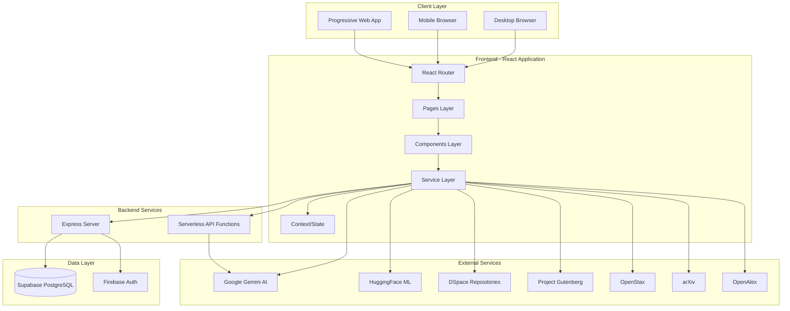

---

## 🎯 System Layers

### **1. Presentation Layer (Frontend)**

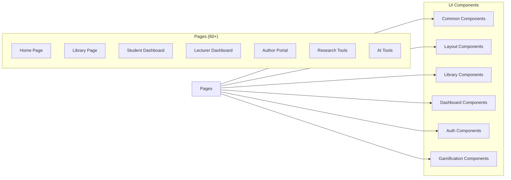

**Key Technologies:**
- React 19 with TypeScript
- Tailwind CSS v4
- Framer Motion for animations
- React Router DOM for navigation
- Vite for bundling and HMR

**Component Organization:**
```
src/components/
├── common/          # Shared UI components (buttons, inputs, cards)
├── layout/          # Layout wrappers (header, footer, sidebar)
├── library/         # Book-specific components
├── dashboard/       # Dashboard widgets
├── author/          # Author-specific tools
├── gamification/    # Achievements, leaderboards
├── research/        # Research tool components
├── tools/           # Utility components
└── ui/              # Base design system components
```

---

### **2. Business Logic Layer (Services)**

```mermaid
graph TB
    subgraph "Service Layer"
        Auth[authService]
        Books[books service]
        AI[ai service]
        Gemini[geminiService]
        Research[researchService]
        DSpaceS[dspaceService]
        Gutenberg[gutenbergService]
        OpenStax[openStaxService]
        Vocational[vocationalService]
        OER[oerService]
        Leaderboard[leaderboardService]
        Enrichment[enrichmentService]
        Transformer[transformerService]
    end
    
    subgraph "Core Libraries"
        Supabase[supabase client]
        Firebase[firebase client]
        Search[search algorithms]
        Offline[offline storage]
        Export[export utilities]
    end
    
    Auth --> Supabase
    Auth --> Firebase
    Books --> Supabase
    AI --> Gemini
    Research --> OpenAlex[OpenAlex API]
    Research --> ArXiv[arXiv API]
```

**Service Responsibilities:**

| Service | Purpose | External APIs |
|---------|---------|---------------|
| `authService.js` | User authentication & authorization | Supabase Auth, Firebase |
| `books.js` | Book CRUD operations | Supabase |
| `ai.js` | AI chat functionality | Gemini API |
| `geminiService.ts` | Google Gemini integration | Google Gemini |
| `dspaceService.ts` | Institutional repositories | DSpace REST API |
| `gutenbergService.ts` | Free ebook access | Project Gutenberg API |
| `openStaxService.js` | Textbook access | OpenStax API |
| `arxivService.ts` | Research papers | arXiv API |
| `openAlexService.ts` | Academic metadata | OpenAlex API |
| `researchService.js` | Research tools | Multiple APIs |
| `vocationalService.js` | Vocational resources | Custom |
| `leaderboardService.js` | Gamification data | Supabase |

---

### **3. Backend Layer**

```mermaid
graph TB
    subgraph "Express Server (server.ts)"
        Middleware[Middleware Stack]
        Routes[API Routes]
        Controllers[Controllers]
    end
    
    subgraph "Middleware"
        CORS[CORS]
        Helmet[Security Headers]
        RateLimit[Rate Limiting]
        ErrorHandler[Error Handler]
    end
    
    subgraph "Serverless Functions"
        AIFunc[/api/ai.ts]
    end
    
    Client[Client Request] --> Middleware
    Middleware --> Routes
    Routes --> Controllers
    Controllers --> DB[(Database)]
    
    Client --> AIFunc
    AIFunc --> Gemini[Gemini API]
```

**Server Configuration:**
- **Port:** 3000 (development)
- **CORS:** Enabled for cross-origin requests
- **Security:** Helmet.js for HTTP headers
- **Rate Limiting:** Express rate limiter
- **API Proxying:** DeepSeek and Gemini AI proxying

**Key Endpoints:**
```
POST /api/chat              # AI chat completion
POST /api/chat/stream       # Streaming AI responses
POST /api/deepseek/v1/chat/completions  # DeepSeek API proxy
```

---

### **4. Data Layer**

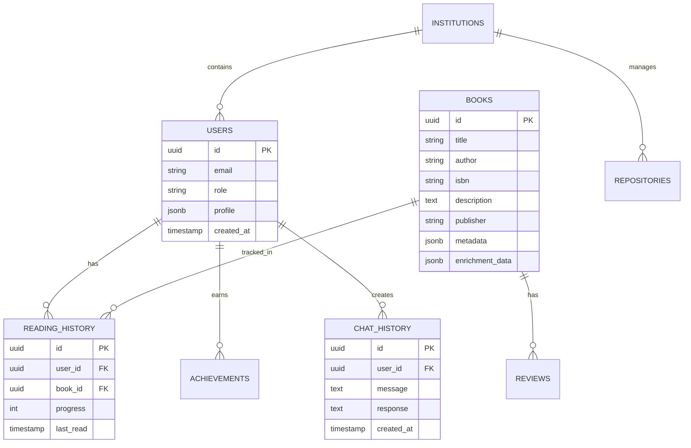

**Database Schema Highlights:**

**Core Tables:**
- `users` - User accounts and profiles
- `books` - Book catalog (1M+ records)
- `reading_history` - User reading progress
- `achievements` - Gamification system
- `chat_history` - AI conversation logs
- `institutions` - Educational institutions
- `repositories` - Institutional repositories

**Key Migrations:**
```
migrations/
├── 007_add_publisher_name.sql
├── 008_add_author_names.sql
├── 009_add_logo_url.sql
├── 010_add_enrichment_data.sql
├── 011_dara_chat_schema.sql
└── 012_digitization_and_reports.sql
```

---

### **5. State Management Architecture**

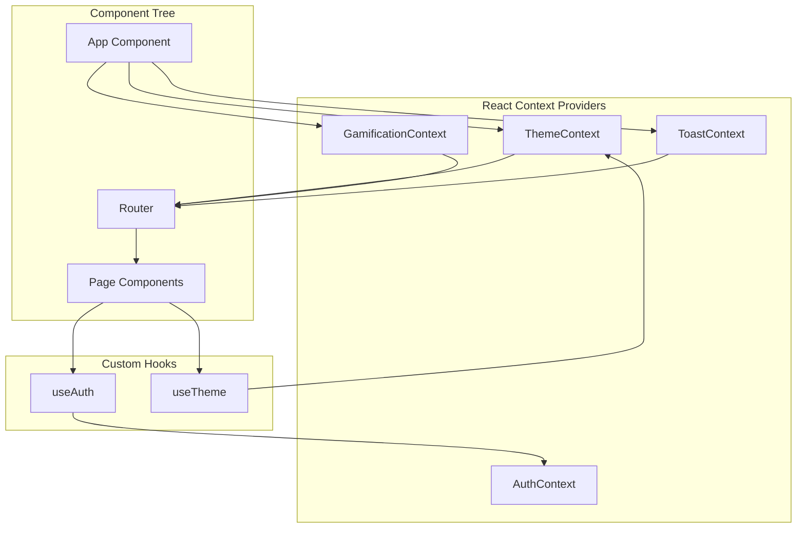

**Context Responsibilities:**

| Context | State Managed | Scope |
|---------|---------------|-------|
| `ThemeContext` | Dark/light mode, color preferences | Global |
| `GamificationContext` | Points, achievements, levels | Authenticated users |
| `ToastContext` | Notifications, alerts | Global |
| `AuthContext` (via useAuth) | User session, permissions | Global |

---

## 🔄 Data Flow Patterns

### **User Authentication Flow**

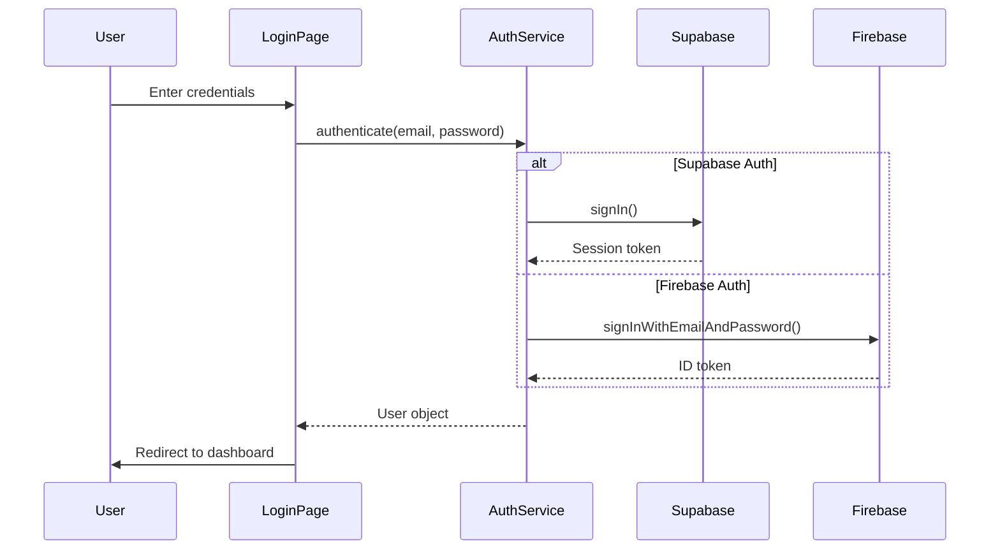

### **AI Chat Flow**

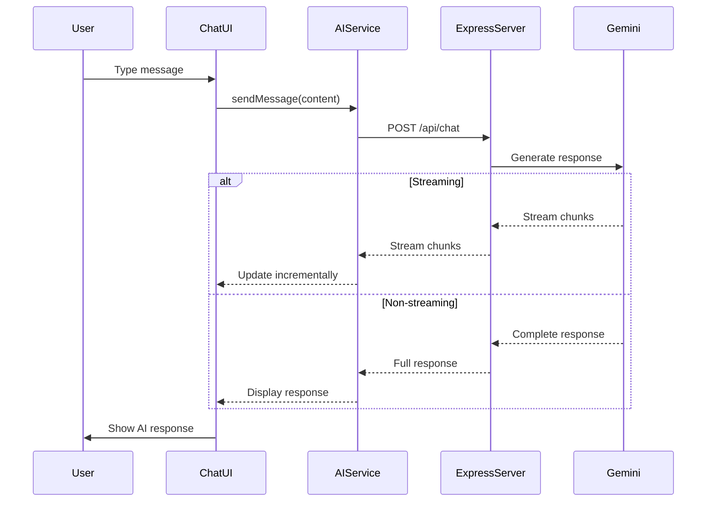

### **Book Search & Discovery Flow**

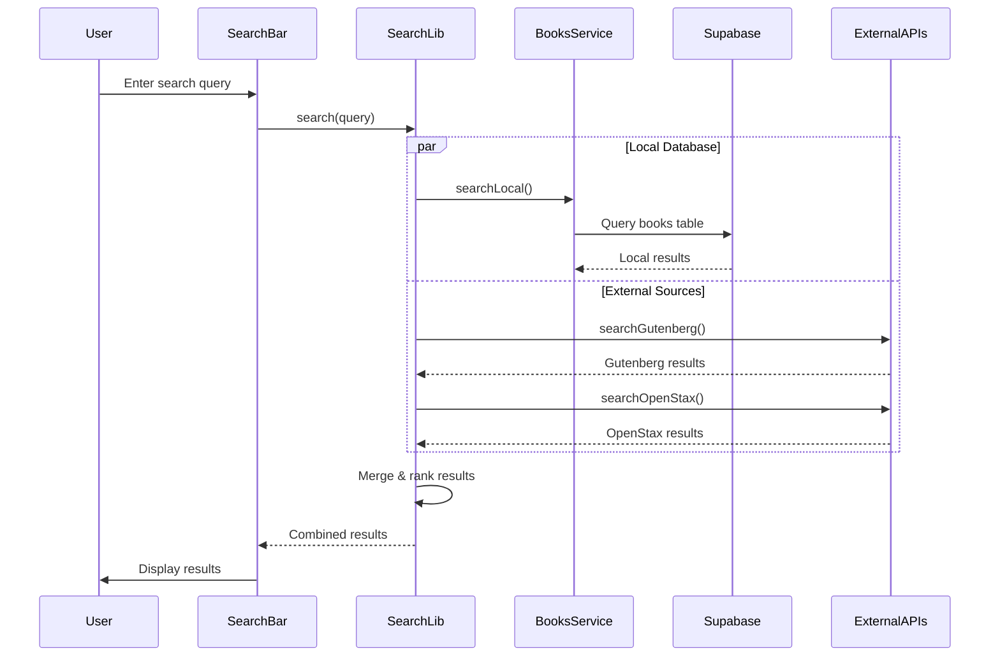

---

## 🚀 Deployment Architecture

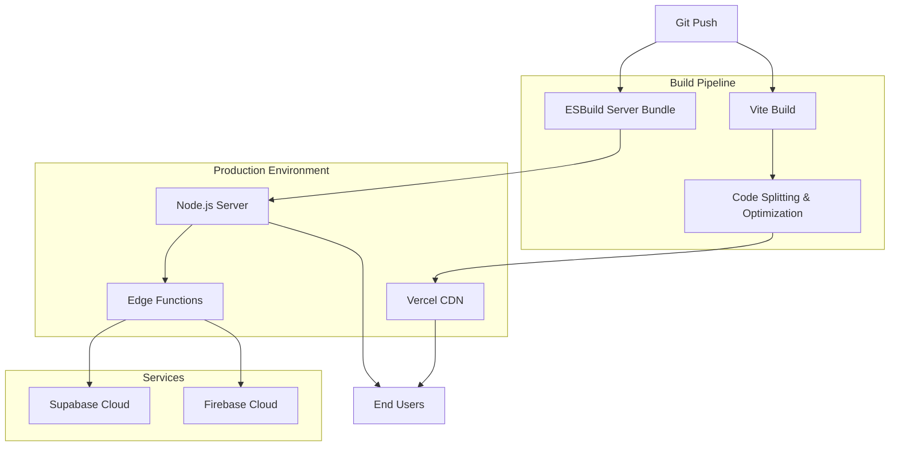

**Deployment Targets:**
- **Frontend:** Vercel (static assets via CDN)
- **Backend:** Vercel Serverless Functions / Netlify Functions
- **Database:** Supabase (managed PostgreSQL)
- **Authentication:** Supabase Auth + Firebase
- **AI Services:** Google Gemini API (external)

**Build Configuration:**

```javascript
// Vite build output
build/
├── assets/
│   ├── vendor-react.js       # 200KB - React runtime
│   ├── vendor-motion.js      # 150KB - Animations
│   ├── vendor-icons.js       # 100KB - Lucide icons
│   ├── vendor-ml.js          # 2MB - ML models (lazy)
│   ├── vendor-pdf.js         # 500KB - PDF viewer (lazy)
│   └── vendor-charts.js      # 300KB - Charts (lazy)
├── index.html
└── manifest.json

// Server build
dist/
└── server.cjs                # Bundled Express server
```

**Code Splitting Strategy:**
- Core React bundle: ~200KB (aggressively cached)
- Route-based splitting for major features
- Lazy loading for heavy dependencies (ML, PDF, Charts)
- Chunk size warning at 600KB

---

## 🔐 Security Architecture

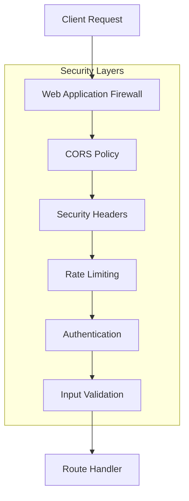

**Security Measures:**

1. **Authentication & Authorization**
   - JWT tokens via Supabase
   - Firebase authentication fallback
   - Role-based access control (Student, Lecturer, Author, Admin)

2. **API Security**
   - CORS configured for trusted origins
   - Helmet.js for security headers
   - Rate limiting on AI endpoints
   - API key management via environment variables

3. **Data Protection**
   - Input validation (validator.js)
   - SQL injection protection (Supabase parameterized queries)
   - XSS protection (DOMPurify for user content)

4. **Environment Variables**
   ```
   GEMINI_API_KEY          # AI service key
   SUPABASE_URL            # Database URL
   SUPABASE_ANON_KEY       # Public Supabase key
   FIREBASE_API_KEY        # Firebase authentication
   DEEPSEEK_API_KEY        # Alternative AI provider
   ```

---

## 📱 Progressive Web App Architecture

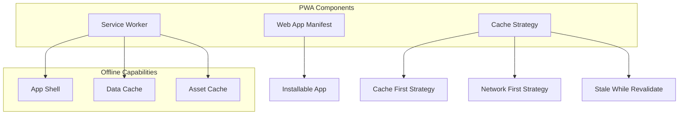

**PWA Features:**

1. **Installability**
   - Web app manifest with icons (72px to 512px)
   - Standalone display mode
   - Theme color: `#0d9488` (teal)

2. **Offline Support**
   - Service worker with Workbox
   - Cache-first for static assets
   - Network-first for API calls
   - Offline fallback page

3. **Caching Strategy**
   ```javascript
   // Google Fonts - Cache First (1 year)
   // Images - Cache First (30 days)
   // API calls - Network First with fallback
   // App shell - Precached
   ```

---

## 🔌 External Integrations

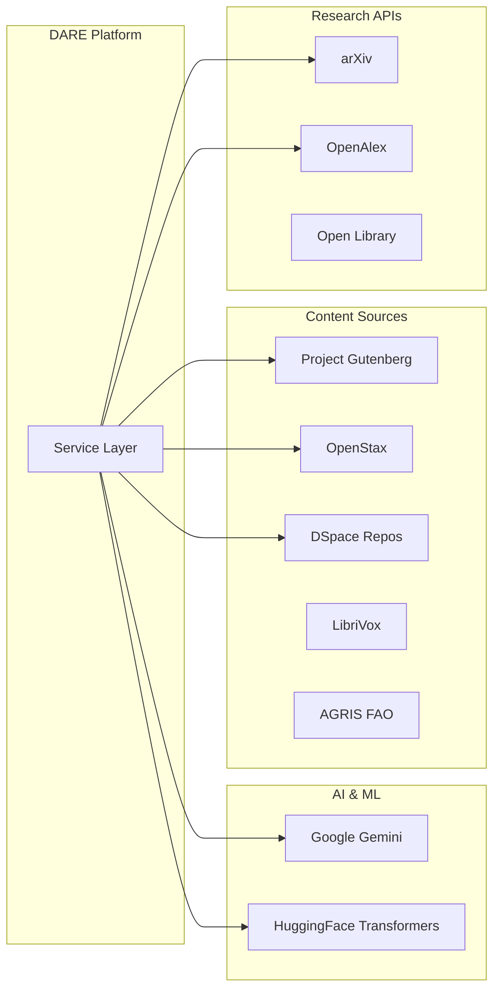

**Integration Details:**

| Service | Purpose | Data Flow |
|---------|---------|-----------|
| **Google Gemini** | AI tutoring, chat, content generation | Bidirectional API |
| **HuggingFace** | Local ML models (transformers) | Client-side inference |
| **DSpace** | Institutional repository integration | REST API |
| **Project Gutenberg** | Free ebook catalog (70k+ books) | Read-only API |
| **OpenStax** | Free textbooks | Read-only API |
| **arXiv** | Academic papers | Read-only API |
| **OpenAlex** | Research metadata | Read-only API |
| **LibriVox** | Free audiobooks | Batch ingestion |
| **AGRIS** | Agricultural research | Batch ingestion |

---

## 📊 Performance Architecture

### **Optimization Strategies**

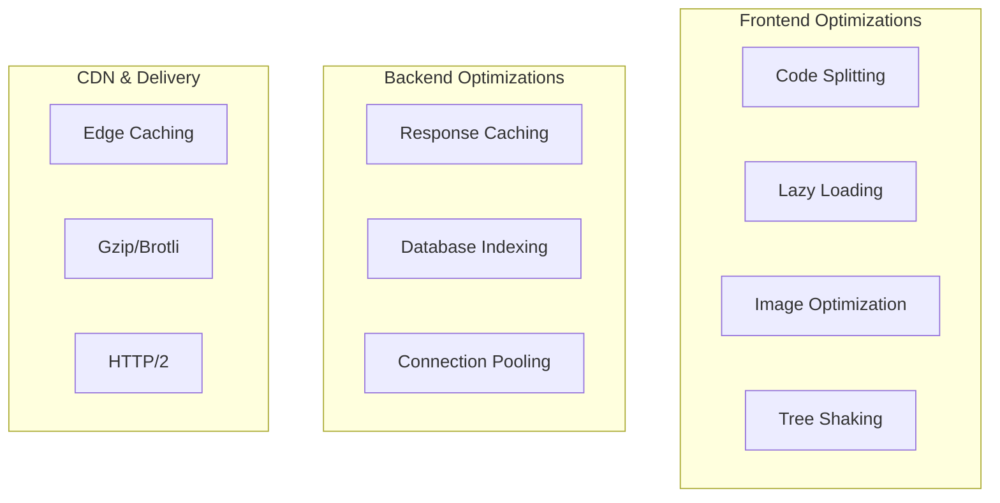

**Performance Metrics:**

| Metric | Target | Strategy |
|--------|--------|----------|
| First Contentful Paint (FCP) | < 1.8s | Code splitting, CDN |
| Time to Interactive (TTI) | < 3.9s | Lazy loading, service worker |
| Largest Contentful Paint (LCP) | < 2.5s | Image optimization |
| Cumulative Layout Shift (CLS) | < 0.1 | Reserved space for dynamic content |
| Bundle Size (Initial) | < 300KB | Aggressive code splitting |

**Code Splitting Configuration:**
```javascript
manualChunks: {
  'vendor-react': ['react', 'react-dom', 'react-router-dom'],  // 200KB
  'vendor-motion': ['motion'],                                   // 150KB
  'vendor-icons': ['lucide-react'],                             // 100KB
  'vendor-ml': ['@xenova/transformers'],                        // 2MB (lazy)
  'vendor-pdf': ['react-pdf'],                                  // 500KB (lazy)
  'vendor-charts': ['recharts', 'd3'],                          // 300KB (lazy)
}
```

---

## 🧪 Testing Strategy (Recommended)

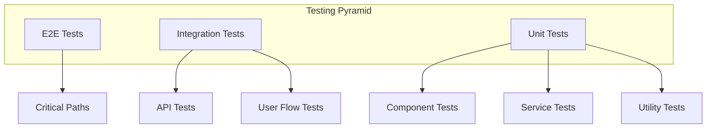

**Recommended Testing Stack:**
- **Unit Tests:** Jest + React Testing Library
- **Integration Tests:** Jest + MSW (Mock Service Worker)
- **E2E Tests:** Playwright or Cypress
- **Coverage Target:** 80%+ for critical paths

---

## 🔧 Development Workflow

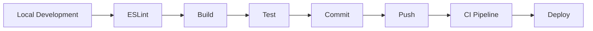

**Local Development:**
```bash
npm run dev          # Start dev server (port 3000)
npm run lint         # Run ESLint
npm run build        # Production build
npm run preview      # Preview production build
npm run check-env    # Validate environment variables
```

**Environment Setup:**
1. Copy `.env.example` to `.env.local`
2. Set `GEMINI_API_KEY` and other required keys
3. Run `npm run check-env` to validate

---

## 📈 Scalability Considerations

### **Current Bottlenecks & Solutions**

| Component | Bottleneck | Solution |
|-----------|------------|----------|
| **Database** | 1M+ book queries | Implement full-text search indexes |
| **AI API** | Rate limits | Implement queue system, caching |
| **Frontend Bundle** | Large initial load | Aggressive code splitting (implemented) |
| **Image Loading** | CDN bandwidth | Implement image CDN, lazy loading |
| **Concurrent Users** | Server capacity | Serverless auto-scaling (Vercel) |

### **Horizontal Scaling Strategy**

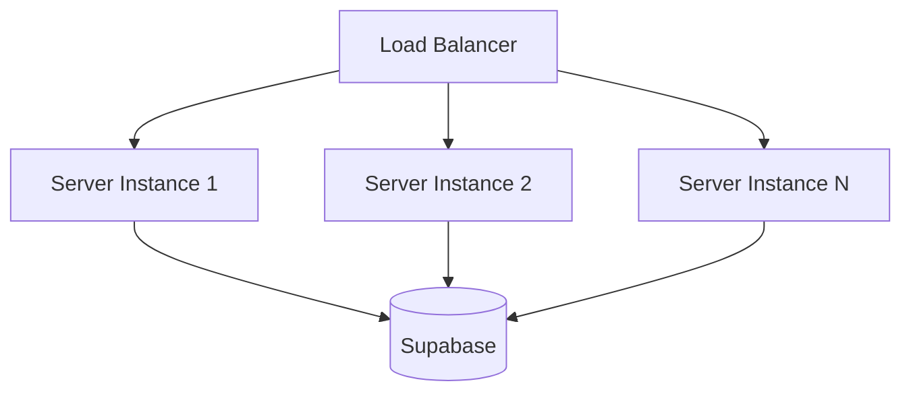

**Auto-scaling Triggers:**
- CPU usage > 70%
- Memory usage > 80%
- Request queue > 100

---

## 🎓 User Roles & Permissions

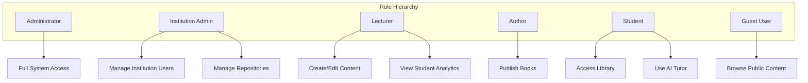

**Permission Matrix:**

| Feature | Guest | Student | Lecturer | Author | Institution | Admin |
|---------|-------|---------|----------|--------|-------------|-------|
| Browse Library | ✓ | ✓ | ✓ | ✓ | ✓ | ✓ |
| Read Books | Limited | ✓ | ✓ | ✓ | ✓ | ✓ |
| AI Tutoring | ✗ | ✓ | ✓ | ✓ | ✓ | ✓ |
| Create Content | ✗ | ✗ | ✓ | ✓ | ✗ | ✓ |
| Publish Books | ✗ | ✗ | ✗ | ✓ | ✗ | ✓ |
| Analytics | ✗ | Own | Class | ✗ | Institution | All |
| User Management | ✗ | ✗ | ✗ | ✗ | ✓ | ✓ |

---

## 🚧 Future Architecture Improvements

### **Phase 1: Foundation (Next 3 months)**
1. ✅ Implement comprehensive testing suite
2. ✅ Add API documentation (OpenAPI/Swagger)
3. ✅ Implement error boundaries
4. ✅ Add performance monitoring

### **Phase 2: Enhancement (3-6 months)**
1. ✅ Migrate to feature-based architecture
2. ✅ Implement microservices for heavy operations
3. ✅ Add Redis caching layer
4. ✅ Implement GraphQL API

### **Phase 3: Scale (6-12 months)**
1. ✅ Container orchestration (Kubernetes)
2. ✅ Implement message queue (RabbitMQ/Redis)
3. ✅ Multi-region deployment
4. ✅ Real-time collaboration features

---

## 📚 Related Documentation

- [README.md](./README.md) - Getting started guide
- [package.json](./package.json) - Dependencies and scripts
- [vite.config.ts](./vite.config.ts) - Build configuration
- [server.ts](./server.ts) - Backend server implementation
- [migrations/](./migrations/) - Database schema evolution

---

## 🤝 Contributing to Architecture

When proposing architectural changes:

1. **Document the problem** - What issue are we solving?
2. **Propose solutions** - Multiple options with pros/cons
3. **Impact analysis** - Performance, security, maintainability
4. **Migration path** - How do we get from current to proposed?
5. **Update this document** - Keep architecture docs current

---

**Last Updated:** 2026-06-24  
**Version:** 1.0.0  
**Maintainer:** DARE Digital Library Team
