# DARE Digital Library - Component Diagrams

## 📋 Overview

This document provides detailed visual representations of the component architecture, showing component relationships, data flow, and integration patterns.

---

## 🎨 Component Hierarchy

### **Complete Component Tree**

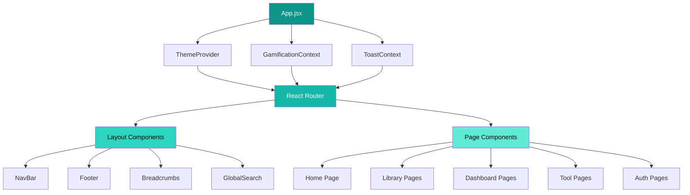

---

## 🏗️ Layout Components Structure

### **Main Layout Architecture**

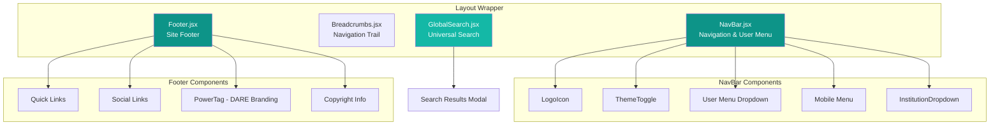

**Component Details:**

| Component | Props | State | Services |
|-----------|-------|-------|----------|
| **NavBar** | `user`, `onLogout` | `mobileMenuOpen`, `userMenuOpen` | `authService` |
| **GlobalSearch** | `placeholder` | `query`, `results`, `isSearching` | `books`, `search` |
| **Breadcrumbs** | `path` | - | - |
| **Footer** | - | - | - |

---

## 📚 Library Components Ecosystem

### **Library Feature Components**

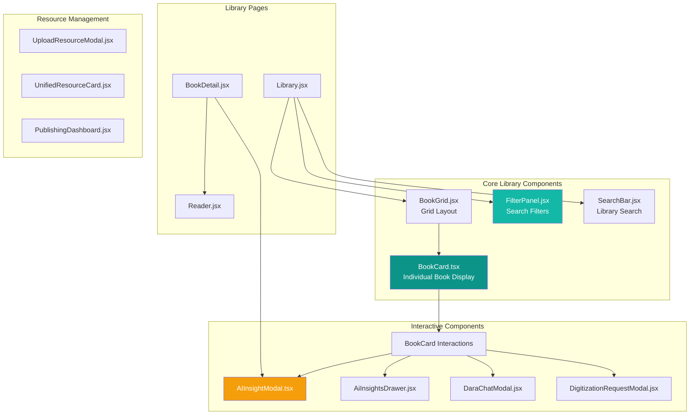

**BookCard Component Props:**

```typescript
interface BookCardProps {
  book: {
    id: string;
    title: string;
    author: string;
    description?: string;
    coverUrl?: string;
    isbn?: string;
    publisher?: string;
    publishedDate?: string;
    pageCount?: number;
    categories?: string[];
    averageRating?: number;
    thumbnail?: string;
  };
  onRead?: (bookId: string) => void;
  onSave?: (bookId: string) => void;
  onShare?: (bookId: string) => void;
  showAIInsights?: boolean;
  compact?: boolean;
}
```

---

## 🎮 Gamification Components

### **Gamification System Architecture**

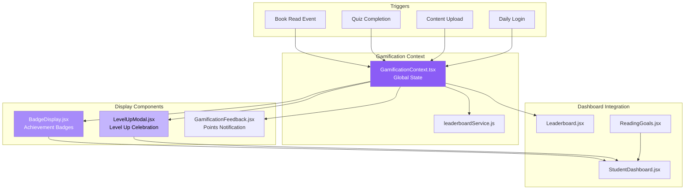

**Gamification Events:**

```javascript
// Event Types
const GamificationEvents = {
  BOOK_READ: 'book_read',           // +10 points
  CHAPTER_COMPLETE: 'chapter_complete',  // +5 points
  QUIZ_PASSED: 'quiz_passed',       // +20 points
  CONTENT_SHARED: 'content_shared', // +5 points
  DAILY_LOGIN: 'daily_login',       // +2 points
  STREAK_MILESTONE: 'streak_milestone',  // +50 points
  BOOK_REVIEWED: 'book_reviewed',   // +15 points
  CONTENT_UPLOADED: 'content_uploaded',  // +30 points
};
```

---

## 🤖 AI Components Architecture

### **AI-Powered Features**

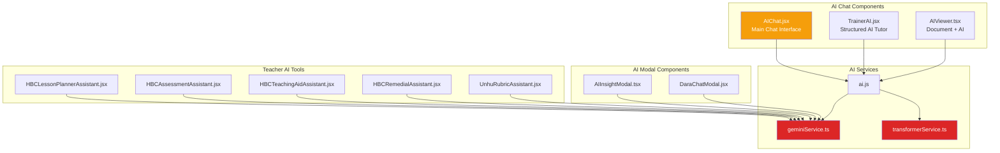

**AI Component Data Flow:**

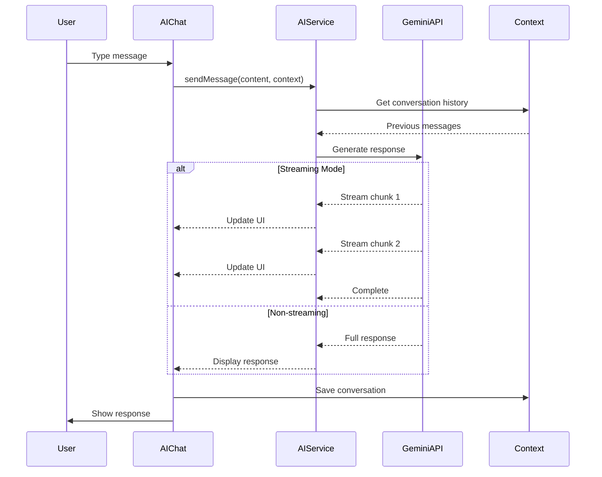

---

## 👤 Dashboard Components

### **Role-Based Dashboard Architecture**

```mermaid
graph TB
    subgraph "Student Dashboard"
        StudentDash[StudentDashboard.jsx]
        StudentStats[Reading Statistics]
        StudentGoals[ReadingGoals.jsx]
        StudentBadges[BadgeDisplay]
        StudentHistory[Reading History]
    end
    
    subgraph "Lecturer Dashboard"
        LecturerDash[LecturerDashboard.jsx]
        ClassAnalytics[Class Analytics]
        StudentProgress[Student Progress]
        ContentManager[Content Manager]
        AssignmentTracker[Assignment Tracker]
    end
    
    subgraph "Author Dashboard"
        AuthorDash[AuthorDashboard.jsx]
        BookStats[Book Statistics]
        UploadWizard[UploadWizard.jsx]
        PublishDash[PublishingDashboard.jsx]
        RevenueTracker[Revenue Tracker]
    end
    
    subgraph "Shared Dashboard Components"
        Charts[Recharts Components]
        DataTables[Data Tables]
        ExportTools[Export Tools]
    end
    
    StudentDash --> StudentStats
    StudentDash --> StudentGoals
    StudentDash --> StudentBadges
    StudentDash --> StudentHistory
    
    LecturerDash --> ClassAnalytics
    LecturerDash --> StudentProgress
    LecturerDash --> ContentManager
    LecturerDash --> AssignmentTracker
    
    AuthorDash --> BookStats
    AuthorDash --> UploadWizard
    AuthorDash --> PublishDash
    AuthorDash --> RevenueTracker
    
    StudentStats --> Charts
    ClassAnalytics --> Charts
    BookStats --> Charts
    
    StudentProgress --> DataTables
    ContentManager --> DataTables
    
    style StudentDash fill:#3b82f6,color:#fff
    style LecturerDash fill:#8b5cf6,color:#fff
    style AuthorDash fill:#ec4899,color:#fff
```

**Dashboard Component Props:**

```typescript
// Student Dashboard
interface StudentDashboardProps {
  user: User;
  readingHistory: ReadingHistory[];
  achievements: Achievement[];
  goals: ReadingGoal[];
}

// Lecturer Dashboard
interface LecturerDashboardProps {
  user: User;
  classes: Class[];
  students: Student[];
  assignments: Assignment[];
}

// Author Dashboard
interface AuthorDashboardProps {
  user: User;
  books: Book[];
  sales: SalesData[];
  analytics: AnalyticsData;
}
```

---

## 🔧 Tool Components

### **Educational Tools Ecosystem**

```mermaid
graph TB
    subgraph "HBC Teacher Tools"
        LessonPlanner[Lesson Planner Assistant]
        AssessmentAid[Assessment Assistant]
        TeachingAid[Teaching Aid Generator]
        RemedialAid[Remedial Assistant]
    end
    
    subgraph "University Tools"
        UnhuRubric[UNHU Rubric Assistant]
        ResearchTools[Research Tools]
    end
    
    subgraph "Integration Tools"
        GoogleWorkspace[GoogleWorkspaceIntegration.tsx]
        DSpaceConnect[DSpace Connection]
    end
    
    subgraph "Content Tools"
        PDFViewer[PDFViewer.tsx]
        MarkdownRenderer[InteractiveMarkdown.jsx]
        CitationMenu[CitationMenu.jsx]
    end
    
    TeacherTools[Teacher Tools Page] --> LessonPlanner
    TeacherTools --> AssessmentAid
    TeacherTools --> TeachingAid
    TeacherTools --> RemedialAid
    
    VocationalTools[Vocational Tools] --> UnhuRubric
    VocationalTools --> ResearchTools
    
    Integration[Integration Page] --> GoogleWorkspace
    Integration --> DSpaceConnect
    
    Reader[Reader Component] --> PDFViewer
    BookDetail[Book Detail] --> MarkdownRenderer
    BookDetail --> CitationMenu
    
    style LessonPlanner fill:#10b981,color:#fff
    style GoogleWorkspace fill:#6366f1,color:#fff
    style PDFViewer fill:#f97316,color:#fff
```

**Tool Component Communication:**

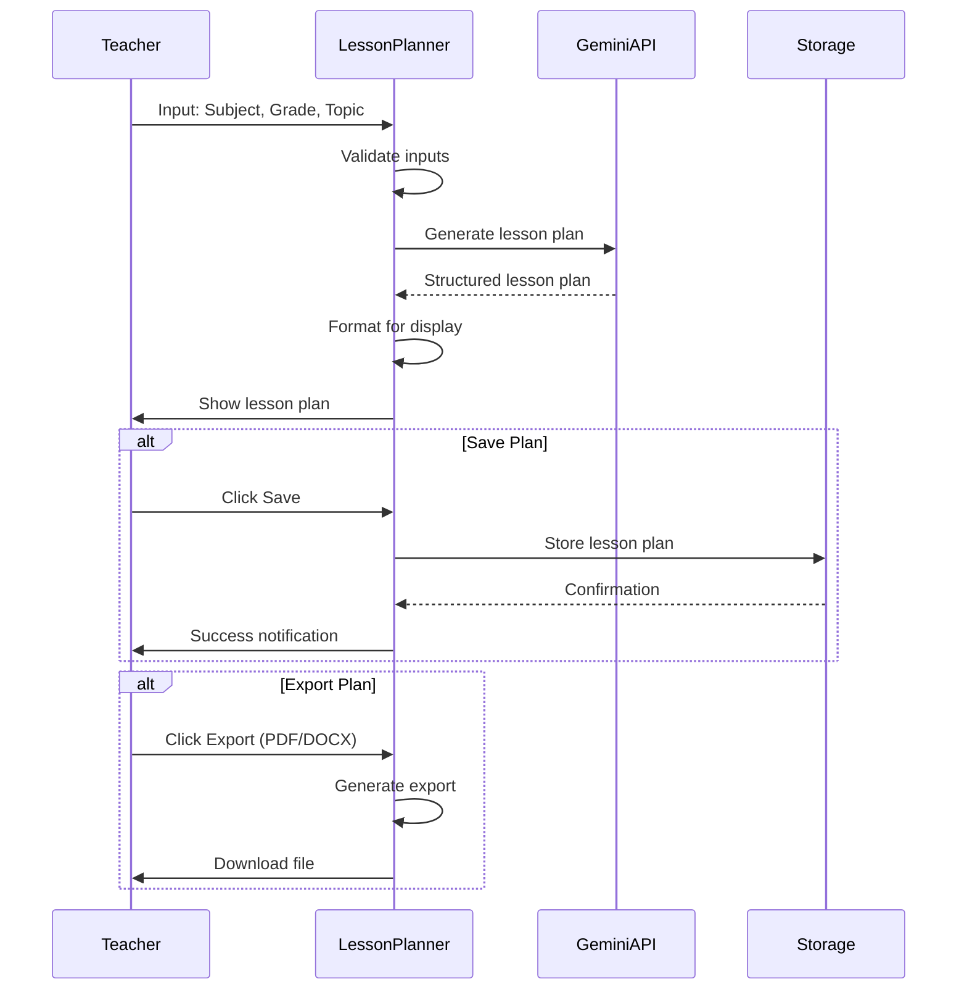

---

## 🔒 Authentication Components

### **Auth Flow Components**

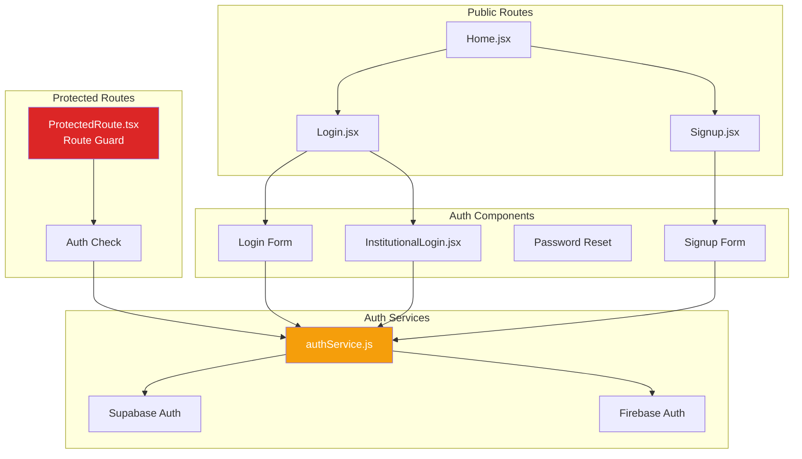

**Authentication Component Props:**

```typescript
// Login Component
interface LoginProps {
  onSuccess?: (user: User) => void;
  redirectTo?: string;
  showInstitutionalOption?: boolean;
}

// Signup Component
interface SignupProps {
  onSuccess?: (user: User) => void;
  defaultRole?: 'student' | 'lecturer' | 'author';
  institutionId?: string;
}

// ProtectedRoute Component
interface ProtectedRouteProps {
  children: ReactNode;
  requiredRole?: 'student' | 'lecturer' | 'author' | 'admin';
  requiredPermissions?: string[];
  fallbackPath?: string;
}
```

---

## 🎯 Common & Utility Components

### **Shared Component Library**

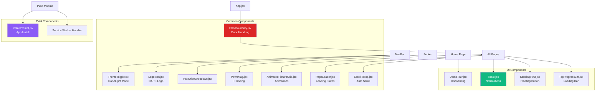

---

## 📊 Data Flow Patterns

### **State Management Flow**

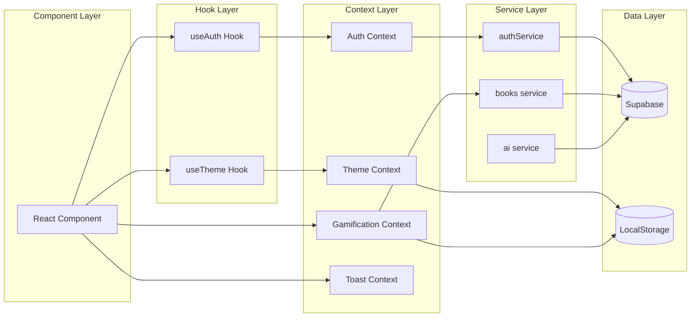

### **Component Communication Patterns**

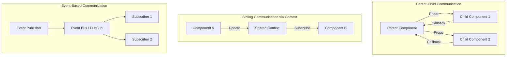

---

## 🎨 Component Styling Patterns

### **Styling Architecture**

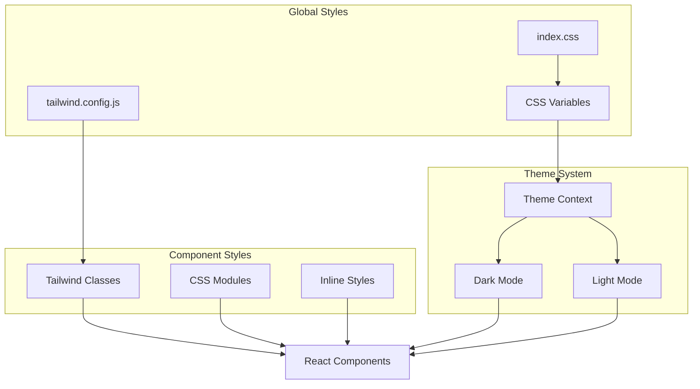

**Styling Convention:**

| Pattern | Use Case | Example |
|---------|----------|---------|
| **Tailwind Utility Classes** | Layout, spacing, basic styling | `className="flex gap-4 p-6"` |
| **CSS Modules** | Component-specific complex styles | `BookCard.module.css` |
| **Global CSS** | Theme variables, resets | `index.css` |
| **Inline Styles** | Dynamic styles based on props | `style={{ width: progress + '%' }}` |

---

## 📱 Responsive Design Patterns

### **Responsive Component Strategy**

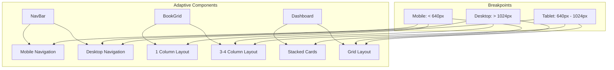

**Responsive Patterns:**

```jsx
// Conditional Rendering
{isMobile ? <MobileMenu /> : <DesktopMenu />}

// Tailwind Responsive Classes
<div className="grid grid-cols-1 md:grid-cols-2 lg:grid-cols-4 gap-4">

// useMediaQuery Hook
const isMobile = useMediaQuery('(max-width: 640px)');
```

---

## 🔄 Component Lifecycle & Effects

### **Component Interaction Timeline**

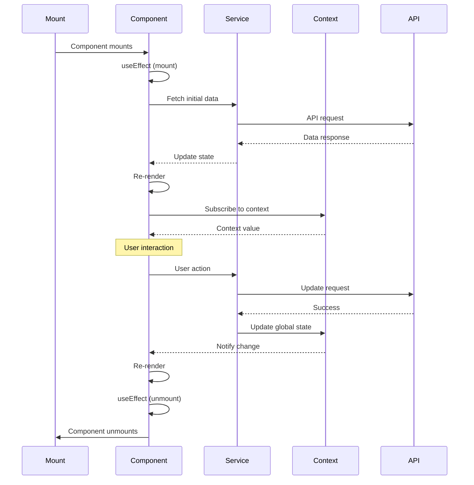

---

## 🧩 Component Composition Patterns

### **Composition Examples**

```mermaid
graph TB
    subgraph "Container/Presenter Pattern"
        Container[Container Component<br/>Logic & State]
        Presenter[Presenter Component<br/>Pure UI]
        
        Container --> Presenter
    end
    
    subgraph "Compound Components"
        Parent[Parent Component]
        Child1[Child Component 1]
        Child2[Child Component 2]
        SharedContext[Shared Context]
        
        Parent --> SharedContext
        SharedContext --> Child1
        SharedContext --> Child2
    end
    
    subgraph "Higher-Order Components"
        HOC[withAuth HOC]
        WrappedComp[Wrapped Component]
        Enhanced[Enhanced Component]
        
        HOC --> WrappedComp
        WrappedComp --> Enhanced
    end
    
    subgraph "Render Props"
        ParentRP[Parent with Render Prop]
        RenderFn[Render Function]
        ChildRP[Child UI]
        
        ParentRP -->|Provides Data| RenderFn
        RenderFn -->|Renders| ChildRP
    end
```

**Pattern Examples:**

```jsx
// Container/Presenter Pattern
const BookCardContainer = ({ bookId }) => {
  const [book, setBook] = useState(null);
  useEffect(() => {
    fetchBook(bookId).then(setBook);
  }, [bookId]);
  return <BookCardPresenter book={book} />;
};

// Compound Components
<Card>
  <Card.Header>Title</Card.Header>
  <Card.Body>Content</Card.Body>
  <Card.Footer>Actions</Card.Footer>
</Card>

// Higher-Order Component
const ProtectedComponent = withAuth(MyComponent);

// Render Props
<DataProvider>
  {({ data, loading }) => (
    <div>{loading ? 'Loading...' : <List data={data} />}</div>
  )}
</DataProvider>
```

---

## 🎯 Component Best Practices

### **Component Design Guidelines**

1. **Single Responsibility**
   - Each component should do one thing well
   - Split complex components into smaller pieces

2. **Props Interface**
   - Use TypeScript interfaces for prop definitions
   - Provide sensible defaults
   - Document complex props with JSDoc

3. **State Management**
   - Keep state as close to where it's used as possible
   - Lift state up when multiple components need it
   - Use context for truly global state

4. **Performance**
   - Use React.memo for expensive pure components
   - Memoize callbacks with useCallback
   - Memoize computed values with useMemo
   - Lazy load heavy components

5. **Accessibility**
   - Use semantic HTML elements
   - Add ARIA labels where needed
   - Ensure keyboard navigation works
   - Test with screen readers

6. **Testing**
   - Write unit tests for component logic
   - Test user interactions
   - Test edge cases and error states

---

## 📦 Component Export Patterns

### **Module Organization**

```javascript
// Named exports for multiple components
export { BookCard } from './BookCard';
export { BookGrid } from './BookGrid';
export { BookDetail } from './BookDetail';

// Default export for main component
export default LibraryPage;

// Barrel exports (index.js)
export * from './components/library';
export * from './components/dashboard';
export * from './components/common';

// Type exports
export type { BookCardProps, BookGridProps } from './types';
```

---

## 🔍 Component Discovery Map

### **Finding Components by Feature**

| Feature | Component Path | Key Components |
|---------|----------------|----------------|
| **Library** | `src/components/library/` | BookCard, FilterPanel, SearchBar |
| **Dashboard** | `src/components/dashboard/` | ReadingGoals, Analytics |
| **AI Tools** | `src/components/` | AIChat, TrainerAI, AIViewer |
| **Layout** | `src/components/layout/` | NavBar, Footer, GlobalSearch |
| **Auth** | `src/pages/` | Login, Signup, ProtectedRoute |
| **Gamification** | `src/components/gamification/` | BadgeDisplay, LevelUpModal |
| **Teacher Tools** | `src/components/tools/` | HBC Assistants, Rubric Tools |
| **Common** | `src/components/common/` | ErrorBoundary, ThemeToggle |
| **UI** | `src/components/ui/` | Toast, ScrollUpFAB, DemoTour |

---

**Last Updated:** 2026-06-24  
**Version:** 1.0.0  
**Related:** See [ARCHITECTURE.md](./ARCHITECTURE.md) for system-level architecture
